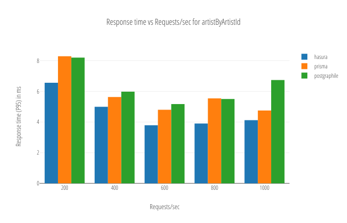

Understanding the performance characteristics of your GraphQL backend is still hard. This is an extremely simple benchmarking tool for you to run common GraphQL queries against your GraphQL backend and get a preliminary sense of your backend's performance characteristics. 

We built this benchmarking suite to benchmark different GraphQL data backends. The database used is a [Postgres variant](https://github.com/xivSolutions/ChinookDb_Pg_Modified/tree/pg_names) of [Chinook](https://github.com/lerocha/chinook-database). The benchmarking tool used is [wrk2](https://github.com/giltene/wrk2), a derivative of [wrk](https://github.com/wg/wrk).

You can easily add your own GraphQL backend and your own GraphQL queries and run your benchmark.

## Running benchmarks

You'll need to have `docker` and `curl` to perform these benchmarks

1. Clone the repo.
   ```bash
   git clone https://github.com/hasura/graphql-bench.git && cd graphql-bench
   ```

2. Setup the graphql servers that you are interested in.
   ```bash
   ./hasura/manage.sh init
   ./prisma/manage.sh init
   ./postgraphile/manage.sh init
   ```

3. Define the queries that you would like to benchmark in `hasura/queries.graphql`, `prisma/queries.graphql`, `postgraphile/queries.graphql`. There are few queries that already exist.

4. Define a benchmark (checkout sample.bench.yaml) say bench.yaml.

5. Run the benchmark
   ```bash
   cat bench.yaml | docker run -i --rm -p 8050:8050 -v $(pwd):/graphql-bench/ws hasura/graphql-bench:0.2
   ```
   or run a benchmark on a sample query
   ```bash
   cat sample.bench.yaml | docker run -i --rm -p 8050:8050 -v $(pwd):/graphql-bench/ws hasura/graphql-bench:0.2 --query artistByArtistId
   ```
   This opens up a http server at http://127.0.0.1:8050 which displays the results of the benchmark.

6. Tear down the setup
   ```bash
   ./hasura/manage.sh nuke
   ./prisma/manage.sh nuke
   ./postgraphile/manage.sh nuke
   ```

## Bench.yaml

This file specifes the benchmarks that need to be run. The file is a list of benchmark specifications where each spec is as follows:
```yaml
  # name of the query in queries.graphql. Should be same across all the candidates
- query: tracks_media_some
  # response timeout
  timeout: 1s
  # the benchmarks are first run for this duration and the results are ignored
  warmup_duration: 60
  # the duration of each benchmark
  duration: 300
  # number of open connections to the server
  open_connections: 20
  # the servers to be benchmarked, their dir and urls
  candidates:
  - dir: hasura
    url: http://172.17.0.1:7080
  - dir: prisma
    url: http://172.17.0.1:4466
  - dir: postgraphile
    url: http://172.17.0.1:5000
  # Requests/sec
  rps:
  - 200
  - 400
  - 600
  - 800
  - 1000
```

By default, when you run
```bash
cat bench.yaml | docker run -i --rm -p 8050:8050 -v $(pwd):/graphql-bench/ws hasura/graphql-bench:0.2
```
all the benchmarks in bench.yaml are run.

You can however run one particular benchmark by specifying the query with ``--query`` argument.
```bash
cat sample.bench.yaml | docker run -i --rm -p 8050:8050 -v $(pwd):/graphql-bench/ws hasura/graphql-bench:0.2 --query artistByArtistId
```

## Sample plot

When the above benchmark is run, the results on an i7-4710HQ CPU, 8GB RAM, SSD machine are as follows:

