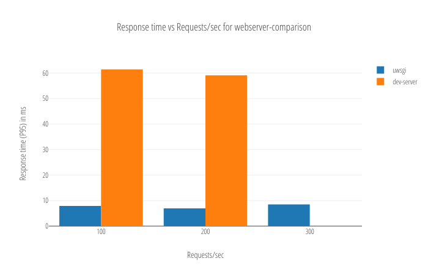
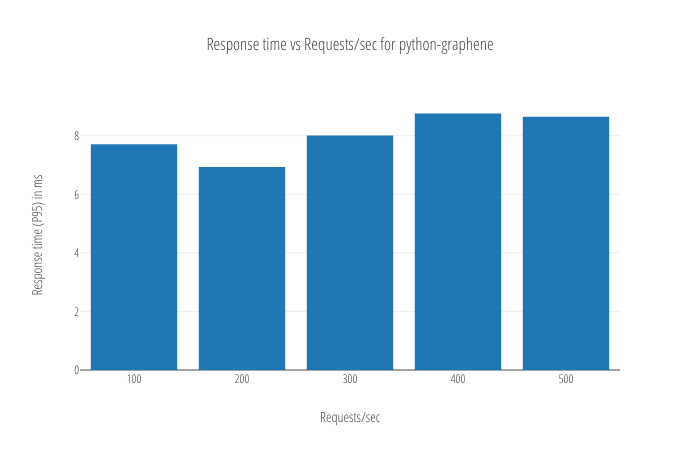

# graphql-bench

A simple benchmarking tool to run GraphQL queries against your GraphQL backend and get a preliminary sense of its performance characteristics. 

Usage: You write your GrahphQL queries in a file, run a command, and your browser opens up with graphs :)



- The benchmarking tool used is [wrk2](https://github.com/giltene/wrk2) to measure [latency](https://news.ycombinator.com/item?id=10695953) [accurately](https://groups.google.com/forum/#!msg/mechanical-sympathy/icNZJejUHfE/BfDekfBEs_sJ).
- The graphs are generated using [dash](https://github.com/plotly/dash).

## Running benchmarks

You'll need `docker` installed on your machine. All the tooling necessary to run and visualise benchmarks is packaged in a docker image.

1. Create a file, say `queries.graphql` with the queries that you are interested in benchmarking.
   ```graphql
   query HeroNameQuery {
     hero {
       name
     }
   }
   ```

1. Specify the benchmarking configuration in a file, say `bench.yaml`.
   ```yaml
   - name: hero_name
     warmup_duration: 60
     duration: 300
     candidates:
     - name: python-graphene
       url: http://127.0.0.1:5000
       query: HeroNameQuery
       queries_file: queries.graphql
     rps:
     - 200
     - 400
   ```

1. Run the benchmark(s).
   ```bash
   cat bench.yaml | docker run -i --rm -p 8050:8050 -v $(pwd)/queries.graphql:/graphql-bench/ws/queries.graphql hasura/graphql-bench:v0.3
   ```

1. This opens up a http server at http://127.0.0.1:8050 which displays the results of the benchmark.
   


## bench.yaml

This file specifes the benchmarks that need to be run. The file is a list of benchmark specifications as follows:
```yaml
  # name of the benchmark.
- name: tracks_media_some

  # response timeout
  timeout: 1s

  # the benchmarks are first run for this duration and the results are ignored
  warmup_duration: 60

  # the duration of each benchmark
  duration: 300

  # number of open connections to the server
  open_connections: 20

  # the servers to be benchmarked, their dir and urls
  candidates:
  - name: myserver
    url: http://172.17.0.1:7080
    query: abc
    queries_file: queries.graphql

  # Requests/sec
  rps:
  - 200
  - 400
```

## Note

If you are looking for benchmarks of [hasura](https://hasura.io), [postgraphile](https://www.graphile.org/postgraphile/) and [prisma](https://prisma.io) head to this [repo](https://github.com/hasura/graphql-backend-benchmarks).
